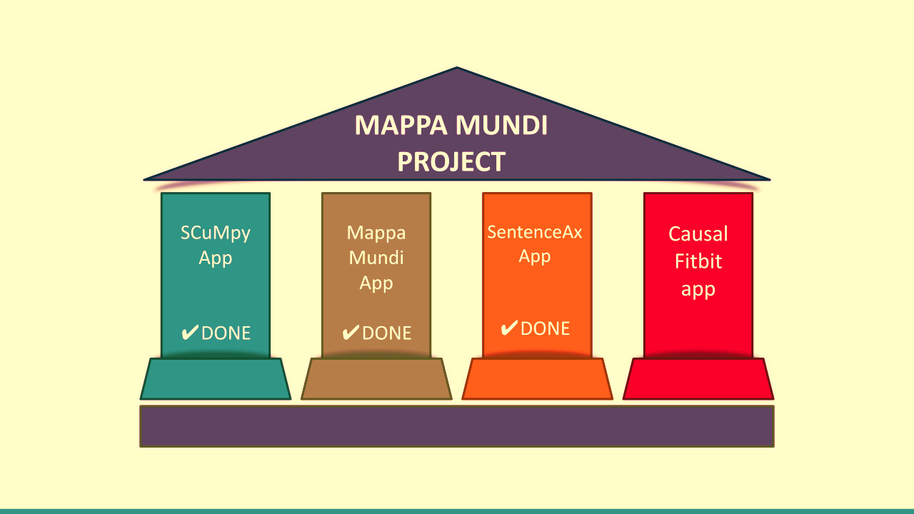
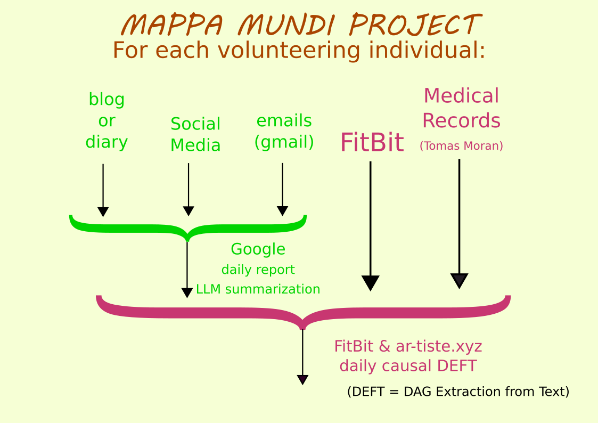

Welcome to CausalFitbit.

CausalFitbit is a Python app
for doing causal DEFT (DAG Extraction From Text).
This is applied herein to a Fitbit dataset available
at Kaggle.

We describe the app in more detail in this 
white paper
* [Version 1](https://github.com/rrtucci/CausalFitbit/blob/master/white_paper/cfitbit.pdf)

